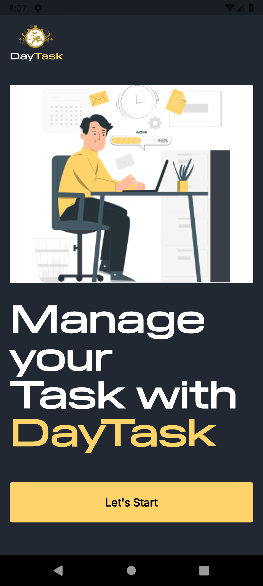
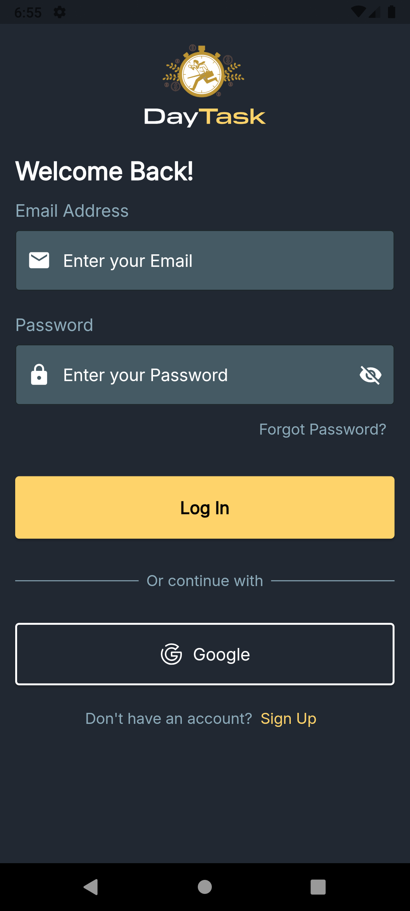
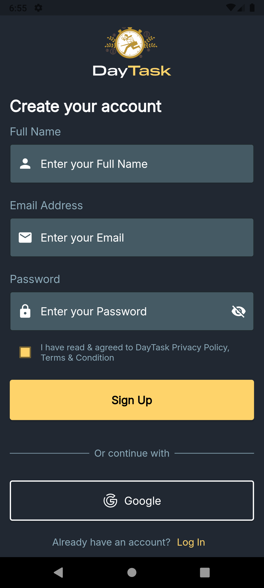
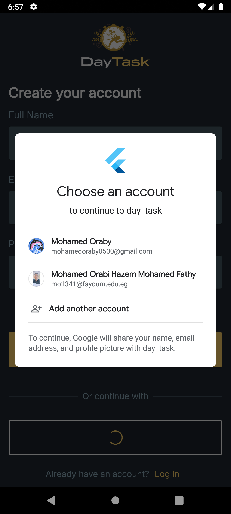

# Day Task App

A powerful Flutter application for managing daily projects, tasks, and team collaborations — featuring real-time chat, project tracking, and Firebase integration.

---

## 🧠 Overview

**Day Task** helps users create and manage projects with assigned tasks, team members, and deadlines.  
The app provides a full task management system with progress tracking and a real-time chat feature for seamless team communication.

This project demonstrates:
- Clean and modular architecture (Cubit + Hive + Firebase).
- Local and cloud data synchronization.
- Scalable and responsive UI with `flutter_screenutil`.

---

## 🚀 Features

- 📋 **Projects & Tasks**
  - Create new projects with title, details, and team members.
  - Add tasks and mark them as completed.
  - Track completed and ongoing tasks with progress indicators.
  - Store tasks locally using **Hive**.

- 💬 **Real-Time Chat**
  - One-to-one and group messaging.
  - “Seen” status for messages.
  - Online/offline status tracking via Firebase Realtime Database.

- 👥 **Team Collaboration**
  - Add and manage project team members.
  - Assign tasks to specific members.
  - Show active projects per user.

- 🌐 **Firebase Integration**
  - **Firebase Auth** for authentication.
  - **Cloud Firestore** for chat and data syncing.
  - **Realtime Database** for presence tracking.

- 🎨 **Responsive & Modern UI**
  - Uses `flutter_screenutil` for full responsiveness.
  - Custom reusable widgets for forms, dialogs, buttons, and lists.
  - Smooth animations and progress indicators.

---

## 🛠️ Tech Stack

- **Framework:** Flutter (v3.7+)  
- **Language:** Dart  
- **State Management:** Cubit / Bloc and Provider
- **Local Storage:** Hive  
- **Backend Services:** Firebase (Auth, Firestore, Realtime Database, Storage)  
- **UI Tools:** Flutter ScreenUtil, Modal Progress HUD NSN  
- **Icons & Assets:** SVGs, FontAwesome Icons  

----

## 🧩 Getting Started

### Prerequisites
- Install [Flutter SDK](https://docs.flutter.dev/get-started/install)
- Have an Android or iOS device/emulator ready

### Run the Project
1. Clone the repository:
   ```bash
   git clone https://github.com/mohamed-oraby10/day_task.git
   
2. Navigate to the folder:
    ```bash
   cd day_task


3. Install dependencies:
    ```bash
    flutter pub get


4. Run the app:
    ```bash
   flutter run

---
## 📸 Screenshots (Example placeholders)


## 🚀 Splash Screen

<p align="center">
  
</p>

---

## 🔑 Login Screen


---

## 🧾 Register Screen
<p align="center">
  
   
</p>


---

## 🏠 Home Screen


---

## 👤 Profile Screen


---

## 💬 Chat & Groups
### chat_screen


### chat_group_screen


### groupes_messages_screen


---

## 📨 Messages
### masseges_screen


### new_message_screen


---

## 📅 Schedule Screen


---

## 🔔 Notifications Screen


---

## 🧠 Projects & Tasks
### create_new_project_screen


### project_details_screen


### create_new_task_screen


### task_details_screen


---

## ➕ Other Screens


---
## 🔮 Future Improvements

- 🔍 Add advanced search and filtering for projects and tasks.  
- 🌗 Implement multi-mode (Dark / Light).  
- 📱 Add push notifications for new messages, tasks, and updates.  
- 🗣️ Add **voice, image, and video sharing** inside team/group chats.  
- 🖼️ Allow team members to **change group icons** and manage group settings.  
- 🚪 Add the ability for users to **leave or delete groups**.  
- 🧩 Apply **MVVM architecture** throughout the entire project for better scalability and separation of concerns.  


---

## 👨‍💻 About the Developer

Developed by Mohamed Oraby
📫 Connect with me:

LinkedIn: https://www.linkedin.com/in/mohamedoraby/

GitHub: https://github.com/mohamed-oraby10
